# Mem8 Architecture: Comprehensive System Overview

## 🌊 System Architecture Diagram

```mermaid
graph TB
    %% Core Memory System (100% Complete)
    subgraph "Core Memory Engine (100%)"
        WaveEngine[Wave-Based Memory Engine<br/>973x faster than Qdrant]
        Grid[2D Memory Grid<br/>32-byte cells]
        Decay[Natural Decay System<br/>Emotional anchoring]
        Interference[Wave Interference<br/>Pattern emergence]
        WaveEngine --> Grid
        Grid --> Decay
        Grid --> Interference
    end

    %% Consciousness System (90% Complete)
    subgraph "Consciousness System (90%)"
        Subconscious[Subconscious Layer<br/>Always running]
        Consciousness[Consciousness Layer<br/>Interest > 70%]
        TextSensor[Text Sensor<br/>NLP processing]
        PersonaTraits[Persona Traits<br/>Interest calculation]
        Subconscious --> |Evaluates all| TextSensor
        TextSensor --> |High interest| Consciousness
        PersonaTraits --> |Influences| TextSensor
    end

    %% Storage & Compression (100% Complete)
    subgraph "Storage & Compression (100%)"
        EmbeddedStore[Embedded Vector Store<br/>SIMD-optimized]
        Compression[Wave Compression<br/>32-byte vectors]
        TemporalComp[Temporal Compression<br/>16→12→10→8 bits]
        MMap[Memory-Mapped Files<br/>Zero-copy]
        EmbeddedStore --> Compression
        Compression --> TemporalComp
        EmbeddedStore --> MMap
    end

    %% Sensory Processing (100% Complete)
    subgraph "Sensory Processing (100%)"
        CrossSensory[Cross-Sensory Binding<br/>±2 second windows]
        AdaptiveAttention[Adaptive Attention<br/>Dynamic priorities]
        SensoryTypes[Audio/Visual/Language/Touch]
        CrossSensory --> AdaptiveAttention
        SensoryTypes --> CrossSensory
    end

    %% Audio System (70% Complete)
    subgraph "Audio System (70%)"
        WaveSynth[Wave→Audio Synthesis<br/>100%]
        VoiceMimic[Voice Mimic<br/>80%]
        Scarlett[Scarlett 18i20<br/>ALSA integration 70%]
        EmotionalSound[Emotional Sonification<br/>100%]
        WaveSynth --> EmotionalSound
        Scarlett --> VoiceMimic
        VoiceMimic --> WaveEngine
    end

    %% Import/Export (100% Complete)
    subgraph "Import/Export (100%)"
        FileUpload[File Upload<br/>PDF/Images/Audio]
        RelationshipExt[Relationship Extraction<br/>Entity graphs]
        ClaudeImport[Claude Import<br/>JSONL conversations]
        TmuxWatcher[Tmux Watcher<br/>Terminal capture]
        FileUpload --> RelationshipExt
        ClaudeImport --> WaveEngine
        TmuxWatcher --> WaveEngine
    end

    %% LLM Integration (100% Complete)
    subgraph "LLM Integration (100%)"
        Ollama[Ollama Backend]
        OpenAI[OpenAI Backend]
        Anthropic[Anthropic Backend]
        LLMEnhance[Memory Enhancement]
        Ollama --> LLMEnhance
        OpenAI --> LLMEnhance
        Anthropic --> LLMEnhance
    end

    %% Identity System (100% Complete)
    subgraph "Identity System (100%)"
        CryptoIdentity[Cryptographic Identity]
        PersonaMemory[Persona-specific Memory]
        UniversalLearning[Universal Learning<br/>8n.is Nexus]
        CryptoIdentity --> PersonaMemory
        PersonaMemory --> UniversalLearning
    end

    %% Web Interface (80% Complete)
    subgraph "Web Interface (80%)"
        HotTub[Hot Tub Mode<br/>Debug UI 80%]
        APIServer[REST API Server<br/>100%]
        UploadServer[Upload Server<br/>100%]
        WebDashboard[Web Dashboard<br/>60%]
        APIServer --> WaveEngine
        UploadServer --> FileUpload
        HotTub --> WebDashboard
    end

    %% Proposed/Future (0-60% Complete)
    subgraph "Proposed Features"
        VideoProc[Video Processing<br/>0%]
        WebRTC[WebRTC Interface<br/>60%]
        PythonSDK[Python SDK<br/>0%]
        K8sOps[Kubernetes Operators<br/>0%]
        VideoProc -.-> |Frame analysis| WaveEngine
        WebRTC -.-> |Browser capture| CrossSensory
        PythonSDK -.-> |NumPy interface| EmbeddedStore
    end

    %% Main Connections
    WaveEngine --> EmbeddedStore
    CrossSensory --> WaveEngine
    Subconscious --> WaveEngine
    Consciousness --> WaveEngine
    LLMEnhance --> WaveEngine
    PersonaMemory --> WaveEngine
    RelationshipExt --> Grid
    WaveSynth <--> WaveEngine

    %% Styling
    classDef complete fill:#4CAF50,stroke:#2E7D32,color:#fff
    classDef partial fill:#FF9800,stroke:#F57C00,color:#fff
    classDef proposed fill:#9E9E9E,stroke:#616161,color:#fff
    
    class WaveEngine,Grid,Decay,Interference,EmbeddedStore,Compression,TemporalComp,MMap,CrossSensory,AdaptiveAttention,SensoryTypes,FileUpload,RelationshipExt,ClaudeImport,TmuxWatcher,Ollama,OpenAI,Anthropic,LLMEnhance,CryptoIdentity,PersonaMemory,UniversalLearning,WaveSynth,EmotionalSound,APIServer,UploadServer complete
    
    class Subconscious,Consciousness,TextSensor,PersonaTraits,VoiceMimic,Scarlett,HotTub,WebDashboard,WebRTC partial
    
    class VideoProc,PythonSDK,K8sOps proposed
```



## 📊 Component Status Overview

### ✅ Complete Components (100%)

#### **Core Memory Engine**
- **Wave-Based Memory Engine**: The heart of Mem8, processing memories as wave patterns
  - 973x faster than Qdrant for insertions (308 µs vs 300 ms)
  - 280-710x faster for searches (5-13 µs vs 3.5-3.9 ms)
  - Wave equation: `M(x,t) = A(x,t)e^(i(ωt-kx)) · D(t) · E(x,t)`
- **2D Memory Grid**: Spatial organization using 32-byte packed cells
- **Natural Decay System**: Memories fade over time unless emotionally anchored
- **Wave Interference**: Similar memories strengthen through constructive interference

#### **Storage & Compression**
- **Embedded Vector Store**: Pure Rust, no dependencies, SIMD-optimized
  - 1.3ns per similarity operation
  - 10.7x smaller memory footprint than traditional stores
- **Wave Compression**: Converts wave patterns to 32-byte vectors in 23ns
- **Temporal Compression**: Progressive precision reduction (16→12→10→8 bits)
- **Memory-Mapped Files**: Zero-copy operations for maximum performance

#### **Sensory Processing**
- **Cross-Sensory Binding**: Unifies memories across modalities
  - ±2 second temporal windows
  - Audio, Visual, Language, and Touch integration
- **Adaptive Attention**: Dynamic priority adjustment based on context
- **Multiple Sensory Types**: Full support for all sensory inputs

#### **Import/Export System**
- **File Upload**: Supports PDF, Word, Excel, JSON, XML, HTML, Images (JPEG/PNG/WebP), Audio (WAV/MP3)
- **Relationship Extraction**: Builds entity graphs across all imported data
- **Claude Import**: Direct JSONL conversation import with temporal preservation
- **Tmux Watcher**: Real-time terminal session capture

#### **LLM Integration**
- **Multiple Backends**: Ollama (local), OpenAI, and Anthropic support
- **Memory Enhancement**: Context-aware memory enrichment
- **Model Compatibility**: Warnings for incompatible models (e.g., mistral-nemo at 50%)

#### **Identity System**
- **Cryptographic Identity**: Secure persona protection
- **Persona-specific Memory**: Individual memory spaces per AI persona
- **Universal Learning**: Shared knowledge through 8n.is Nexus

#### **Audio Components (Fully Complete)**
- **Wave→Audio Synthesis**: Convert memory patterns to sound
- **Emotional Sonification**: Happy memories = higher frequencies, Sad = lower
- **Event Sounds**: Unique audio signatures for memory operations

#### **Web Infrastructure (Complete Parts)**
- **REST API Server**: Full CRUD operations for memories
- **Upload Server**: Multi-format file processing endpoint

### 🚧 Partially Complete Components (60-90%)

#### **Consciousness System (90%)**
- **Subconscious Layer**: Always running, evaluates every input
  - Processes all stimuli through persona traits
  - Calculates interest levels (0-100%)
- **Consciousness Layer**: Activates only for high-interest events (>70%)
- **Text Sensor**: Natural language processing with nuanced understanding
- **Persona Traits**: Individual characteristics affecting interest calculation

#### **Audio System (70%)**
- **Voice Mimic (80%)**: Capture voice → Store as waves → Synthesize back
- **Scarlett 18i20 Integration (70%)**: Professional audio interface via ALSA
  - 20-channel support
  - Phantom power control
  - Real-time processing pipeline

#### **Web Interface (80%)**
- **Hot Tub Mode (80%)**: Collaborative debugging interface
  - Real-time memory visualization
  - Wave pattern analysis
  - Rubber duck debugging AI 🦆
- **Web Dashboard (60%)**: Memory exploration and management UI

#### **WebRTC Interface (60%)**
- Browser-based audio/video capture
- Real-time streaming to memory system
- Cross-browser compatibility in progress

### 🔮 Proposed Features (0%)

#### **Video Processing**
- MP4/AVI/MOV file support
- Frame-by-frame emotional analysis
- Scene detection and wave mapping
- Temporal relationship extraction

#### **Python SDK**
- NumPy-compatible interface
- Pandas DataFrame integration
- Scikit-learn compatible transformers
- Jupyter notebook support

#### **Kubernetes Operators**
- Production deployment automation
- Auto-scaling based on memory load
- Health monitoring and recovery
- Multi-cluster synchronization

## 🔗 Key Interconnections

### Data Flow Patterns

1. **Memory Creation Pipeline**:
   ```
   Input → Sensory Processing → Wave Engine → Compression → Storage
   ```

2. **Consciousness Flow**:
   ```
   Stimulus → Subconscious Evaluation → Interest Calculation → 
   (if >70%) → Consciousness Activation → Enhanced Processing
   ```

3. **Audio Pipeline**:
   ```
   Scarlett Input → ALSA → Voice Mimic → Wave Patterns → 
   Memory Storage → Wave Synthesis → Audio Output
   ```

4. **Import Pipeline**:
   ```
   File Upload → Format Detection → Content Extraction → 
   Relationship Analysis → Wave Generation → Memory Grid
   ```

### Critical Integration Points

- **Wave Engine ↔ All Components**: Central hub for all memory operations
- **Subconscious → Wave Engine**: Continuous low-level memory formation
- **LLM Enhancement → Memories**: Enriches raw inputs with context
- **Persona System → Interest Calculation**: Determines consciousness activation
- **Cross-Sensory Binding → Temporal Windows**: Creates rich, multi-modal memories

## 🎯 Performance Characteristics

### Benchmarked Metrics
- **Insertion Speed**: 973x faster than Qdrant (308 µs)
- **Search Speed**: 280-710x faster (5-13 µs)
- **Memory Footprint**: 10.7x smaller (48 vs 512 bytes)
- **Compression Speed**: 23ns per wave pattern
- **SIMD Operations**: 1.3ns per similarity calculation

### Design Targets
- Sub-microsecond retrieval (<1μs)
- 1M memories/second ingestion rate
- Real-time audio processing (<10ms latency)
- Natural decay simulation at 60Hz

## 🚀 Future Roadmap

### Q1 2025
- Complete consciousness system integration
- Finalize Scarlett audio pipeline
- Launch Hot Tub collaborative mode

### Q2 2025
- Video processing implementation
- Python SDK release
- Kubernetes production deployment
- WebRTC full browser support

### Long-term Vision
- Distributed memory clusters
- Quantum-inspired interference patterns
- Brain-computer interface compatibility
- AGI-ready memory substrate

## 💡 Key Innovations

1. **Wave-Based Architecture**: First memory system to use quantum-inspired wave mechanics
2. **Emotional Anchoring**: Memories persist based on emotional significance
3. **Consciousness/Subconscious Split**: Mimics human cognitive architecture
4. **Extreme Compression**: 32-byte vectors vs 512+ bytes traditional
5. **Cross-Sensory Binding**: True multi-modal memory formation
6. **Natural Decay**: Organic forgetting unless reinforced
7. **Persona-Driven Processing**: Individual AI personalities with unique interests

This architecture represents a fundamental shift from static vector databases to dynamic, living memory systems that behave like actual biological memory - with all its imperfections, associations, and emotional coloring.