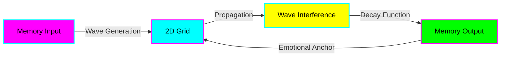

# Test Markdown File

This is a test markdown file to demonstrate the rendering capabilities.

## Features

- **Bold text** and *italic text*
- `Inline code` snippets
- [Links to other files](ARCHITECTURE.md)

### Code Block

```javascript
function waveFunction(x, t) {
  const amplitude = Math.sin(x * 0.1 + t * 0.01);
  return amplitude * Math.exp(-x * 0.001);
}
```

## Mermaid Diagram

Here's a wave propagation diagram:



## Wave Equation

The core wave equation is:

> M(x,t) = A(x,t)e^(i(ωt-kx)) · D(t) · E(x,t)

Where:
- **A(x,t)** = Amplitude function
- **ω** = Angular frequency
- **k** = Wave number
- **D(t)** = Decay function
- **E(x,t)** = Emotional modulation

---

Back to [Architecture](ARCHITECTURE.md) | [Context](Context.md)